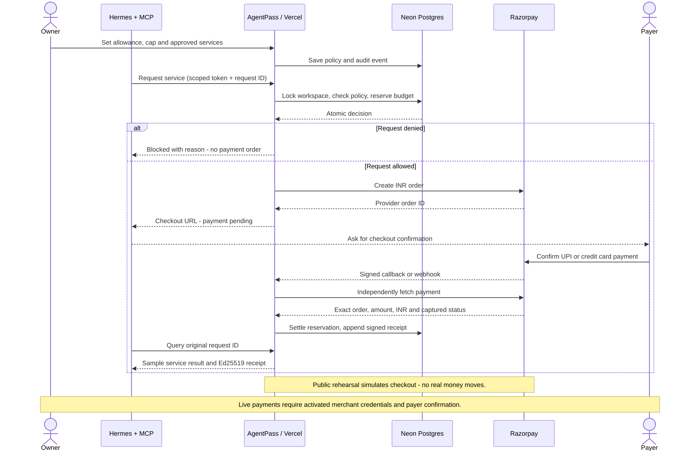

# AgentPass

Public showcase: **https://agentpass-buildx.vercel.app**

An identity and spending-control layer for AI agents, with a public observation dashboard, Hermes integration, UPI/card checkout, and signed purchase receipts. Built for BuildX.

**Start here:** [Setup guide](SETUP.md) · [Event demo](docs/DEMO.md) · [Removal and restoration](docs/ROLLBACK.md)

## What works

- Stable owner-attested agent identity with a scoped agent API token.
- Atomic spending reservations, total allowance, per-purchase cap, service allowlist and owner revocation.
- Hosted Razorpay checkout for UPI and cards, with separate rehearsal, provider test and live environments.
- Provider payment verification: server-owned order ID, callback HMAC, independent payment fetch, exact amount/currency matching and captured status.
- Signed webhook handling and reconciliation of uncertain provider orders.
- Ed25519 receipts, signature verification and JSON export.
- Dashboard with purchase ledger, activity stream, owner controls and isolated public rehearsal sessions.
- Four MCP tools for Hermes, installed into a separate removable event profile.

## Local development

Requires Node.js 22+, npm and Python 3 with PyYAML for the optional Hermes launcher.

```sh
npm ci
npm run setup
npm run dev
```

Open http://localhost:3000 and choose **Try interactive demo**. No external account is required for local rehearsal. Owner access is in the ignored `.agentpass-private/OWNER-ACCESS.txt` file. Production requires Postgres; local development can use a private JSON file.

```sh
npm test
npm run typecheck
npm run build
```

## Payment scope

The prototype collects payment at the connected Razorpay merchant for its integrated sample services. It is **not** an issuer of bank accounts/cards, a wallet custodian, or a way to spend at arbitrary external merchants. UPI and card payments require the human payer's confirmation in hosted checkout. AgentPass never receives card PAN/CVV or UPI PINs.

`PAYMENT_MODE=rehearsal` simulates outcomes, `razorpay_test` uses test keys and `razorpay_live` uses an activated merchant's live keys. Public interactive demos always stay in rehearsal, even when the owner workspace is live. Real payment verification remains dependent on activated provider credentials and a payer completing checkout.

Funding reference rotation demonstrates that identity and history can survive a binding change. It **does not rotate actual bank/card credentials**. This prototype uses an owner-issued identity; it does not implement ERC-8004, government identity verification or provider-independent trust.

## Implementation



Next.js App Router + React, Postgres (Neon on Vercel), Razorpay REST/Standard Checkout, MCP SDK and Node crypto. INR amounts are integer paise. A transaction locks a workspace row before admitting requests, so concurrent serverless functions share one authoritative spending ledger. The small event dataset is stored as JSONB; this is intentionally an event prototype, not a general-purpose payments accounting platform.

Reservations are not released merely because a checkout tab closes or a provider request times out. The provider may have accepted the payment. Reconcile first. Revocation blocks new requests; previously issued provider orders may still settle and remain included in the budget.

The early crypto research in `docs/agentpass-assessment.md` is background only. The implemented scope is documented here and in `SETUP.md`.
